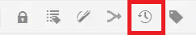
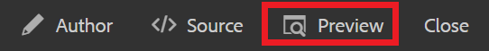

# Versioning Content

Versioning a document creates a snapshot of its current state. Creating multiple versions of a topic or map allows you to keep track of your changes and recover older work.

>[!VIDEO](https://video.tv.adobe.com/v/336724?quality=12&learn=on)

## Creating a new version

1. Select the Save as New Version icon.

   

   The Save as New Version dialog displays.

1. In the Comments for new Version field, enter a brief but clear summary of changes.
1. In the Version Labels field, enter any relevant labels.

   Labels allow you to specify the version you want to include when publishing.

   >[!NOTE] 
   >
   >If your program is configured with predefined labels, you can select from these to ensure consistent labelling. 

1. Select **Save**.

   You have created a new version of your topic, and the version number is updated. The first version of a document will be Version 1.0.

## Viewing your Version History

Once you have multiple versions of your content, you may want to explore the differences between them.

1. Select the Version History icon from the toolbar.

   

   The Version History dialog displays.

1. Select a version from the dropdown to compare your current version against.

   Your version-to-version changes are indicated.

## Reverting to a selected version

If needed, you can select a version and revert back to it. This allows you to discard the current version and return to working with an earlier one.

1. In the Version History dialog, select the version you would like to revert to from the dropdown.
1. Select **Revert to selected Version**.

The Revert Version dialog displays.

1. Add a descriptive comment as to why you are reverting to a previous version.
1. Select **Confirm**.

   Your topic has reverted back to the specific version.

## Using filters to compare versions

You can also view version differences in Preview using the Tracking and Show Diff filters in the right rail.

1. Select **Preview** from the top menu bar.

   

   Your topic opens in Preview.

1. In the Tracking dropdown on the right rail, select **Show Markup**.
1. In the Show Diff dropdown, select the version you would like to compare with.

   Your changes display as formatted content.
