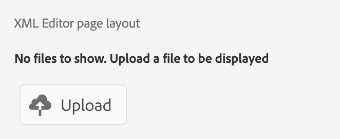

# Overview

When migrating from the old UI to the new AEM Guides UI, updates to **ui_config** must be converted to more flexible and modular UI configurations. This framework helps adopt changes seamlessly into the **editor_toolbar** and [other toolbars](/help/courses/course-3/conver-ui-config.md#editing-json-for-different-screens). The process also supports modifying other views and widgets in the application. 


## Editing JSON for different screens

JSON files can be added to the XML Editor UI Configuration section for various screens and widgets. Below is a list of widely used widgets and their IDs:

1. [editor_toolbar](assets/toolbars/editor_toolbar.json): Webeditor toolbar consisting of file and content actions.
1. [editor_tab_bar](assets/toolbars/editor_tab_bar.json): Tabbed view of open files within webeditor, has actions you can perform on opened files.
1. [file_mode_switcher](assets/toolbars/file_mode_switcher.json): It helps switching between different available modes (author, source, preview) for the opened files within webeditor.

    

1. [map_console_navigation_bar](assets/toolbars/map_console_navigation_bar.json): It is the information bar for map opened in map console. It allows changing map and provides access to settings.
1. [map_console_action_bar](assets/toolbars/map_console_action_bar.json): This is the action bar for map console items such as Output Preset, Baseline, Translation, and Reports which provides relevant information along with their respective action buttons.

    

1. [home_navigation_bar](assets/toolbars/home_navigation_bar.json): Header bar of Guides home page where welcome message is displayed along with selected folder profile.

    

<br>

## General Structure of each JSON

Each JSON follows a consistent structure:

1. **id**: Specifies the widget where the component is being customized.
1. **targetEditor**: Defines when to display or hide a button using editor and mode properties:
    
    Currently we have these **editor** and **mode** in our system.
    
    **editor**: ditamap, bookmap, subjectScheme, xml, css, translation, preset, pdf_preset

    **mode**: author, source, preview, toc, split 
    
    (Note: toc mode applies to layout view.)

1. **target**: Specifies where the new component will be added. This uses key-value pairs or indexes for unique identification. View states include:
  
      * **append**: Add at the end.

      * **prepend**: Add at the beginning.

      * **replace**: Replace an existing component.

Example JSON Structure:

```json
{
  "id" : "editor_toolbar",
  "view": {
    "items": [
      {
        ...,
        "targetEditor": {
          "mode": [
            "preview"
          ],
          "editor": [
            "xml"
          ]
        },
        "target": {
          "key": "label",
          "value": "Table",
          "viewState": "prepend"
        },
        ...
      },
    ]
  }
}
```

<br>

## Examples

Below is an example of how to add, delete or replace a button in the editor toolbar.

### Adding a Button

Adding a new button **Insert Custom Table** in **editor_toolbar** to add a simple table which is visible only in preview mode.

```json
{
  "id": "editor_toolbar",
  "view": {
    "items": [
      {
        "icon": "table",
        "title": "Insert Custom Table",
        "on-click": {
          "name": "$$AUTHOR_INSERT_ELEMENT",
          "args": [
            "simpletable",
            "table",
            "choicetable"
          ]
        },
        "key": "$$AUTHOR_INSERT_ELEMENT",
        "targetEditor": {
          "mode": [
            "preview"
          ],
        },
        "target": {
          "key": "label",
          "value": "Table",
          "viewState": "prepend"
        }
      }
    ]
  }
}
```

  

### Deleting a Button

Deleting a button from the toolbar. Here we remove the adding Image button from the editor toolbar.

```json
{
  "id": "editor_toolbar",
  "view": {
    "items": [
      {
        "hide": true,
        "target": {
          "key": "label",
          "value": "Image",
          "viewState": "replace"
        }
      }
    ]
  }
}
```

### Replacing a Button

Replacing the **Multimedia** button from the toolbar with **Youtube** link insertion button which is only visible in author mode.

```json
{
  "id": "editor_toolbar",
  "view": {
    "items": [
      {
        "icon": "s2youtube",
        "title": "Youtube",
        "on-click": {
          "name": "$$AUTHOR_INSERT_ELEMENT",
          "args": "<object data='http://youtube.com'></object>"
        },
        "targetEditor": {
          "mode": [
            "author"
          ]
        },
        "target": {
          "key": "elementId",
          "value": "toolbar-multimedia",
          "viewState": "replace"
        }
      }
    ]
  }
}
```


<br>

## How to upload customized JSONs

1. On **XML Editor configuration** tab click on **Edit** in the topbar.
1. Now in **XML Editor UI configuration** sub-section you will be able to see a **upload** button.

    {width="400" height="150"}

1. You can click and upload the modified json. (The json to be uploaded should have same name as the id of widget being customized)
1. Once uploaded, hit **Save** in topbar.

    For each uploaded file you can also **delete** the json to remove its customizarion from the UI or **download** to view or modify it again.

    {width="400" height="150"}

<br>


## How to upload customized CSS

You can also add css to customize the look and feel of custom added buttons or already existing widgets or buttons on the UI.

For a newly added custom button add an **extraclass** to custom button or component inside the JSON.
For an old class, you can inspect element and modify the existing classes as well.

```json
{
  "icon": "table",
  "title": "Insert Custom Table",
  "extraclass": "custom-css",
  "key": "$$AUTHOR_INSERT_ELEMENT",
  "targetEditor": {
    "mode": [
      "preview"
    ],
  },
  "target": {
    "key": "label",
    "value": "Table",
    "viewState": "prepend"
  }
}
```

1. On **XML Editor configuration** tab click on **Edit** in the topbar.
1. Now in **XML Editor page layout** sub-section you will be able to see a **upload** button.

    {width="400" height="150"}

1. You can click and upload the modified css. (Only css files are supported)
1. Once uploaded, hit **Save** in topbar.

    For each uploaded file you can also **delete** the css to remove its customizarion from the UI or **download** to view or modify it again.

    {width="400" height="150"}


<br>

### Example to customize button css 

Here we add a new button **Insert Custom Table** in **editor_toolbar** to add a simple table which is visible only in preview mode and apply a custom css on it.
This css modifies the background of button and font size of its title.


```css
#editor_toolbar {
  .custom-css {
    background-color: burlywood;
    font-size: 2rem;  
  }
}
```

```json
{
  "id": "editor_toolbar",
  "view": {
    "items": [
      {
        "icon": "table",
        "title": "Insert Custom Table",
        "extraclass": "custom-css",
        ...
      }
    ]
  }
}
```

<br>

## Steps to convert ui config to modular Jsons

1. From the Navigation screen, click the [!UICONTROL **Tools**] icon.

    

1. Select **Guides** on the left panel.

1. Click the [!UICONTROL **Folder Profiles**] tile.

    

1. Select a Folder Profile.

1. Click the [!UICONTROL **XML Editor Configuration**] tab.

1. You can click on the **Convert UI config to JSON** button. This will generate the **editor_toolbar** and **map_console_action_bar** json which contains the changes done in **ui_config**.

    

1. You can checkout the sample generated jsons for [Editor toolbar](assets/editor_toolbar.json) and [Map console action bar](assets/map_console_action_bar.json)


>[!NOTE]
>
>Changes made to **toolbar** and **topbar** sections is added in **editor_toolbar** json which can be seen on Editor page. The changes that are made to buttons related to Presets or Translation in **ui_config** are added to **map_console_action_bar** json which can be seen on Map Console page.
