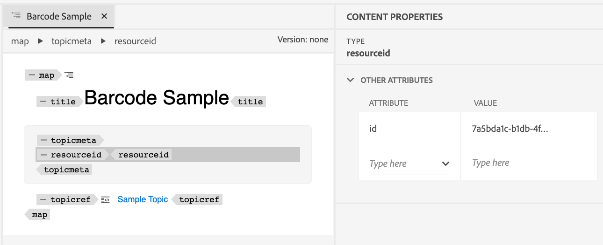

# Add barcode 

Barcodes can be useful to include information that can be easily processed by machines. Similarly, QR-codes can be used for links that readers can open with their mobile devices. 

This tutorial demonstrates how to add barcodes on the top of every page in the generated PDF document. 


### Resource ID in DITA map

Resource ID element is added to the DITA map which will be content for the barcode. 

```xml
<?xml version="1.0" encoding="UTF-8"?>
<!DOCTYPE map PUBLIC "-//OASIS//DTD DITA Map//EN" "technicalContent/dtd/map.dtd">
<map id="GUID-3c330691-4dac-4020-904a-d2d6246aeeb1-en">
  <title>Barcode Sample</title>
  <topicmeta>
    <resourceid id="7a5bda1c-b1db-4fd8-8763-a731e2e8abba">
    </resourceid>
  </topicmeta>
  <topicref href="GUID-139f6c64-bea3-4f17-8b22-ee131557e249-en.dita" type="topic">
  </topicref>
</map>  
```

It's also possible to edit this ID in authoring mode. 




### Adding barcode placeholder to the template header

`Common.plt` file in the Basic template is modified to add barcode after project title.  

```html
...
  <div data-region="header">
    <p class="chapter-header"><span data-field="project-title" data-format="default">Project Title</span> </p>
    <p><span class="barcode" data-field="metadata" data-format="default" data-subtype="//resourceid/@id">Resource ID (barcode)</span></p>
  </div>
} 
...
```


### Updating template CSS to render value as barcode

`content.css` file is modified to render barcode during PDF generation. Various barcode types like 'qrcode' and 'pdf417' are available.  


```css
...
.barcode {
  -ro-replacedelement: barcode;
  -ro-barcode-type: code128;
}
...
```

Following steps described above we can generate PDF output with barcode. 


## References 

[Barcode types available](https://www.pdfreactor.com/samples/#av_section_6).

